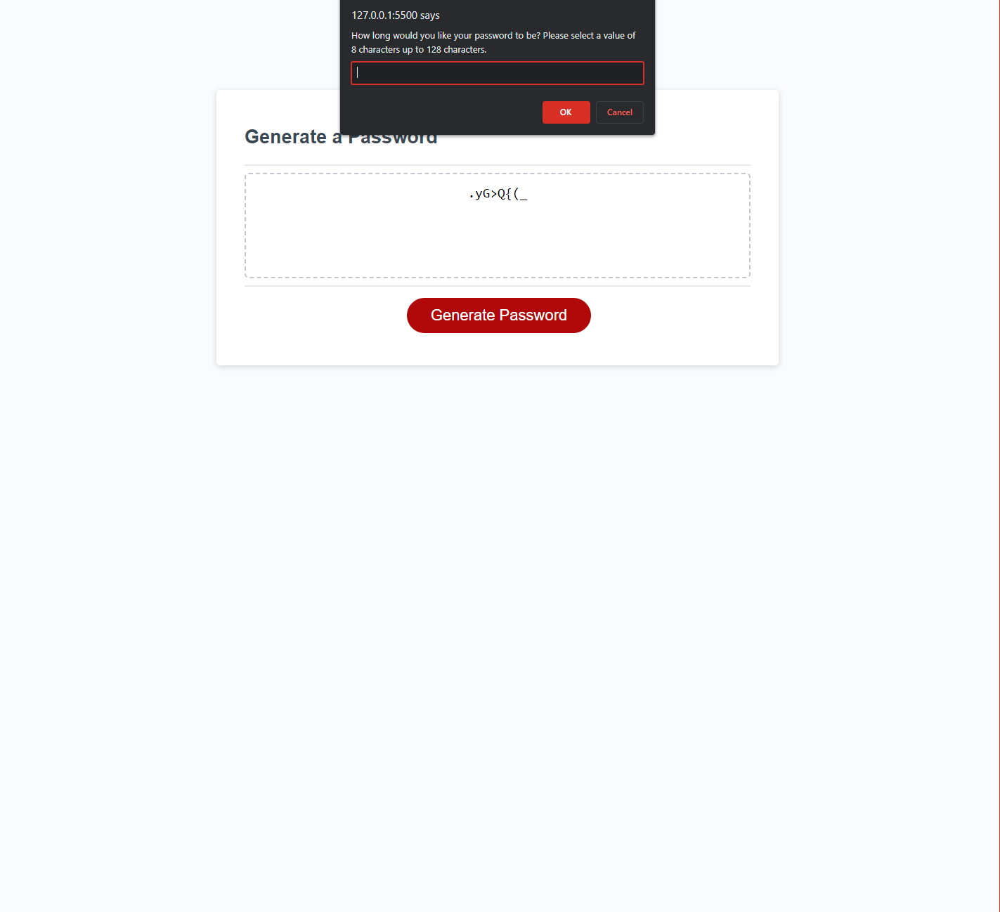

# Password-Generator

## Description

The project solves the issue of needing to randomly generating a password for various services that require either, uppercase letters, lowercase letter, numbers and special characters.

-My motivation was to create an easier way to generate highly secure passwords with ease. 
-I built this project to ensure that I am generating a random password that meets the criteria.
-The project solves the problem that humans have a more difficult time creating random password than computers.
-What I learned was how to arrays and use them as sub arrays for a parent array. I also learned how to use confirm messages, alert, and prompts to gather input from a user. Finally I learned how to use JavaScript if statements and for loops.

## Usage

The web page is used to generate a secure password with a length and character inclusion of the users choice.

Here is a link to the webpage.

http://127.0.0.1:5500/Week-3-Challenge/Password-Generator/index.html

'''md

'''

## Credits
Ross
EdX UConn
Meg Myers
ChatGPT
MDN